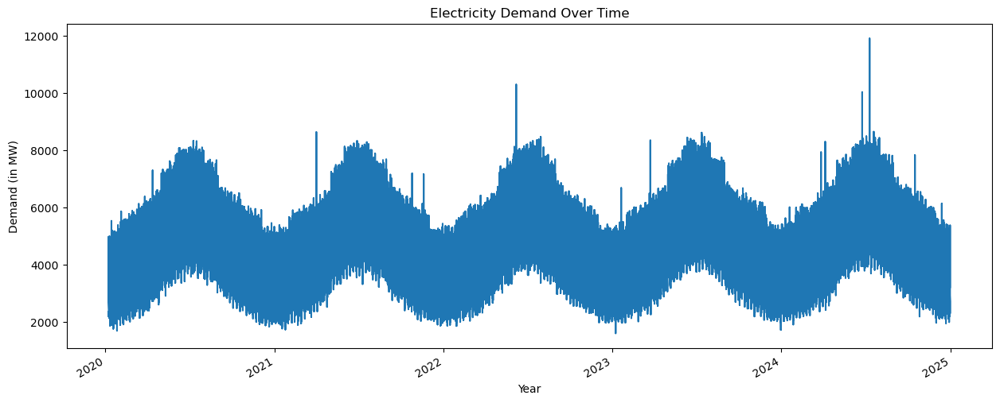
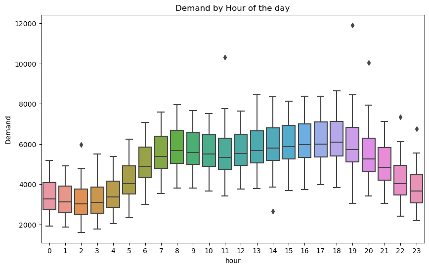
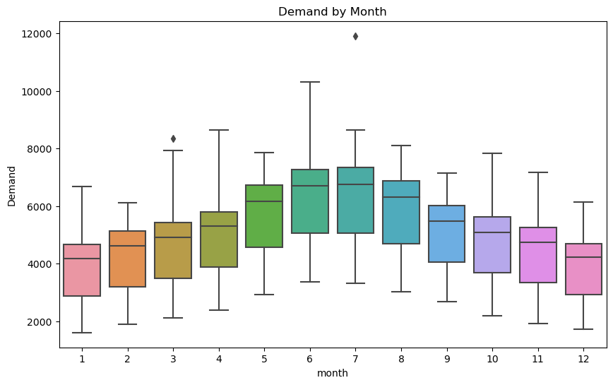
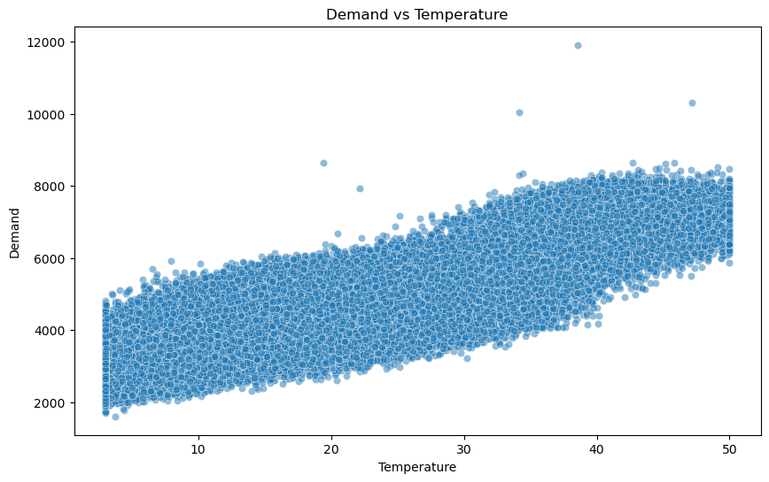
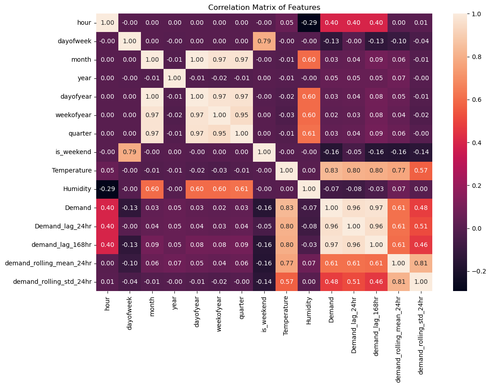
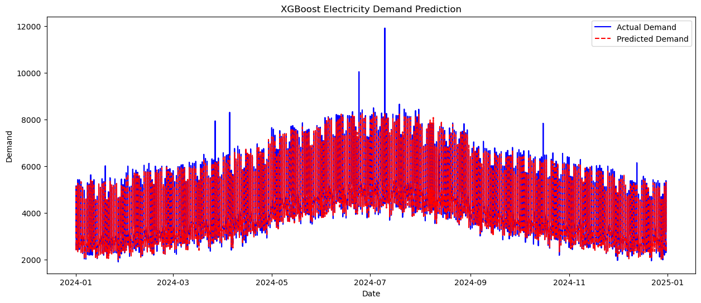

# Electricity Demand Forecasting

A comprehensive data-driven project to forecast electricity demand based on historical weather and temporal features using time series analysis, feature engineering and predictive modeling with XGBoost.

## Features

- **Time Series Analysis**
- **Feature Engineering**
- **Data Visualization**
- **Predictive Modeling**
- **Model Evaluation**

## Dataset

The dataset used in this project contains the following features:

-   `Timestamp`: The date and time of the record.
-   `Temperature`: The temperature at the time of the record.
-   `Humidity`: The humidity at the time of the record.
-   `Demand`: The electricity demand at the time of the record.

## Data Preprocessing and Feature Engineering

The following steps were taken to preprocess the data and engineer new features:

1.  **Loading the Data**
2.  **Data Cleaning**:
    -   The `Timestamp` column is converted to the `datetime` format and set as the index.
    -   Missing values are handled by:
        -   Dropping rows with all `NaN` values.
        -   Using forward-fill (`ffill`) for temporal features.
        -   Using backward-fill (`bfill`) for weather features.
        -   Using time-based interpolation for the `Demand` column.
3.  **Feature Engineering**:
    -   The following features were extracted from the `Timestamp` index:
        -   `hour`
        -   `dayofweek`
        -   `month`
        -   `year`
        -   `dayofyear`
        -   `quarter`
    -   A new boolean feature, `is_weekend`, was created.

## Visualizations

### Distribution of Electricity Demand

### Electricity Demand Over Time

### Demand Distribution by Month

### Demand vs. Temperature

### Correlation Matrix

### Actual vs. Predicted Demand

## Modeling and Evaluation

-   **Model**: An XGBoost Regressor is used for its high performance and ability to handle complex non-linear relationships.
-   **Evaluation**: The model's performance is evaluated using the Mean Absolute Error (MAE) on the test set.

## Results

The XGBoost model was able to achieve a low Mean Absolute Error, indicating a high level of accuracy in forecasting electricity demand. The feature importance plot revealed that temporal features like `hour`, `dayofweek` and `month` were the most influential in predicting demand.

## Usage

1.  Open the `notebook.ipynb` file in a Jupyter Notebook environment.
2.  Run the cells sequentially to see the data preprocessing, feature engineering, model training and evaluation steps.